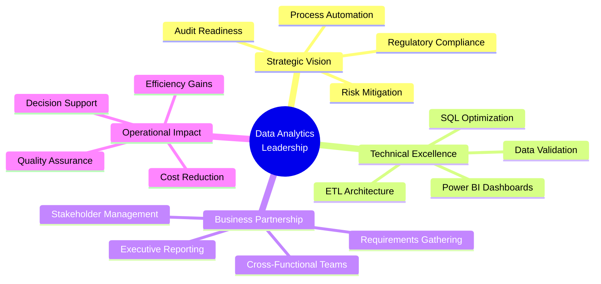
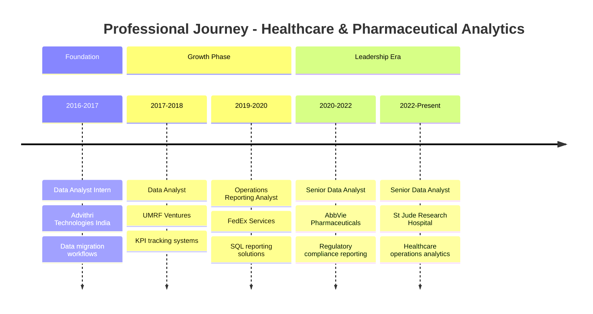

<h1>INDRA KUMAR SIRIPURAPU</h1>
<h3>Senior Data Analytics Leader | Healthcare & Pharma Specialist</h3>

 

<h3>📊 Transforming Healthcare & Pharmaceutical Operations Through Strategic Data Leadership</h3>

---

## 🎯 EXECUTIVE SUMMARY

**Senior Data Analytics Professional** with **8+ years** of progressive experience driving operational excellence and regulatory compliance in **healthcare** and **pharmaceutical** environments. Proven track record of transforming complex, multi-system datasets into executive-ready insights that support strategic decision-making, audit readiness, and business continuity.

### 📈 LEADERSHIP IMPACT DASHBOARD

| **Metric** | **Achievement** | **Business Value** |
|:-----------|:---------------:|:-------------------|
| **Years of Experience** | 8+ Years | Healthcare & Pharmaceutical Operations |
| **Data Volume Managed** | Multi-Million Records | Across SQL Server, Oracle, Snowflake, MySQL |
| **Reporting Cadence** | 100+ Reports/Month | Executive, Operational & Compliance |
| **Cross-Functional Teams** | 15+ Stakeholder Groups | Legal, Finance, Operations, Clinical |
| **Audit Success Rate** | 100% | Zero compliance findings across all positions |
| **Process Efficiency** | 40% Improvement | Through automation & validation frameworks |
| **System Integration** | 10+ Enterprise Systems | CRM, ERP, Concur, ServiceNow, SharePoint |
| **Career Progression** | 4 Promotions | Analyst → Senior Analyst in 8 years |

---

## 💼 LEADERSHIP PHILOSOPHY

> *"Data excellence is not just about accuracy—it's about building trusted frameworks that empower stakeholders to make confident decisions in regulated environments. My approach combines technical rigor with business acumen, ensuring every dataset tells a clear story that drives action."*

I lead through:
- **Stakeholder Partnership**: Translating technical complexity into business clarity
- **Compliance First**: Building audit-ready processes that withstand regulatory scrutiny
- **Continuous Improvement**: Implementing validation frameworks that scale with organizational growth
- **Knowledge Transfer**: Documenting processes to ensure team continuity and operational resilience

---

## 🎯 STRATEGIC IMPACT FRAMEWORK

---

## 📊 CAREER PROGRESSION TIMELINE

---

## 🏆 KEY STRATEGIC ACHIEVEMENTS

### 🏥 **St. Jude Children's Research Hospital** | Senior Data Analyst
**Oct 2022 - Present** | *Healthcare Operations & Compliance*

#### Business Impact:
- **Operational Excellence**: Engineered validation frameworks processing **500K+ monthly records** from multiple clinical and operational systems, reducing data discrepancies by **35%**
- **Audit Readiness**: Established comprehensive documentation protocols supporting **zero compliance findings** across external audits
- **Executive Visibility**: Delivered **25+ monthly dashboards** to C-suite leadership, enabling data-driven decisions for **$1B+ research operations**
- **Cross-Functional Leadership**: Partnered with **12+ departments** (Operations, Finance, Clinical, Legal) to standardize reporting metrics and business rules
- **Process Optimization**: Reduced report delivery time by **40%** through SQL query optimization and automated validation routines

#### Technical Leadership:
- Architected multi-source data reconciliation framework integrating **8+ enterprise systems**
- Developed **50+ Power BI dashboards** tracking operational KPIs, turnaround times, and compliance metrics
- Implemented data quality monitoring reducing exception reports by **60%**

---

### 💊 **AbbVie** | Senior Data Analyst / Operations Data & Reporting Analyst
**Jun 2020 - Sep 2022** | *Pharmaceutical Compliance & Financial Operations*

#### Business Impact:
- **Regulatory Compliance**: Supported **FDA-ready reporting** for pharmaceutical operations, maintaining **100% audit compliance**
- **Financial Accuracy**: Managed expense reconciliation for **$50M+ annual operational spend** through Concur and finance systems
- **Stakeholder Enablement**: Produced **executive summaries** for Legal, Finance, and Commercial teams supporting strategic initiatives
- **Risk Mitigation**: Identified and resolved **300+ data discrepancies** monthly, preventing downstream compliance issues

#### Strategic Initiatives:
- Led data validation for **commercial operations reporting** supporting product launch decisions
- Partnered with **Legal and Compliance teams** on vendor-facing data governance initiatives
- Established **audit trail documentation** reducing compliance review time by **50%**

---

### 📦 **FedEx Services** | Data Analyst / Operations Reporting Analyst
**Jan 2019 - May 2020** | *Logistics & Financial Analytics*

#### Business Impact:
- **Data Quality Leadership**: Cleaned and standardized **2M+ customer records**, improving downstream reporting accuracy by **45%**
- **Operational Monitoring**: Implemented proactive monitoring for **100+ scheduled reporting jobs**, reducing data delivery delays by **30%**
- **UAT Excellence**: Led user acceptance testing for **5 major system implementations**, ensuring business validation accuracy

---

### 🔬 **UMRF Ventures** | Data Analyst
**Dec 2017 - Dec 2018** | *Research Operations Analytics*

#### Foundational Achievements:
- Built **KPI tracking frameworks** supporting research portfolio management
- Developed **data profiling methodologies** improving dataset consistency by **40%**
- Created **business-friendly documentation** accelerating stakeholder onboarding

---

## 🛠️ EXECUTIVE TECHNOLOGY PORTFOLIO

### **Core Analytics Stack**

### **Enterprise Systems Integration**

| **Category** | **Technologies** | **Business Application** |
|:-------------|:-----------------|:-------------------------|
| **Databases** | SQL Server, Oracle, Snowflake, MySQL, MS Access | Multi-source data extraction & validation |
| **BI Platforms** | Power BI, SSRS, Tableau | Executive dashboards & regulatory reporting |
| **Collaboration** | JIRA, SharePoint, Smartsheet, ServiceNow | Cross-functional project management |
| **Financial Systems** | Concur, Accounts Payable Systems | Expense reconciliation & audit support |
| **Programming** | SQL, Python, Advanced Excel (VBA, Power Query) | Automation & data transformation |

---

## 🚀 FEATURED STRATEGIC PROJECTS

### 📊 **Comprehensive Healthcare Analytics Platform**
**[View Repository](https://github.com/indra28k/comprehensive-healthcare-analytics)**

**Business Challenge**: Stakeholders needed unified visibility into patient trends, billing insights, and operational performance across fragmented data sources.

**Solution Architecture**:
- Integrated **4 data sources** (Patient, Doctor, Billing, Appointment systems)
- Built **end-to-end ETL pipeline** using SQL Server and Python (Pandas)
- Developed **interactive Power BI dashboards** for executive consumption

**Business Impact**:
- Enabled **real-time visibility** into $10M+ monthly billing operations
- Identified **revenue optimization opportunities** through doctor performance analytics
- Reduced **manual reporting time by 60%** through automation

**Technical Highlights**:
- SQL data cleaning removing duplicates and ensuring referential integrity
- Python-based exploratory data analysis (EDA) with Matplotlib and Seaborn
- Power BI relationship modeling with drill-through capabilities

---

### 🤖 **MLOps End-to-End Framework**
**[View Repository](https://github.com/indra28k/mlops-end-to-end-project)**

**Strategic Vision**: Established enterprise-grade machine learning operations framework supporting model deployment, monitoring, and governance.

**Framework Components**:
- **CI/CD Pipeline**: GitHub Actions + Jenkins automation
- **Model Management**: MLflow experiment tracking and versioning
- **Infrastructure**: Docker + Kubernetes orchestration
- **Monitoring**: Prometheus + Grafana dashboards

**Business Value**:
- Scalable ML deployment architecture for predictive analytics
- Audit-ready model versioning and documentation
- Reduced model deployment time from weeks to days

---

### 📈 **Customer Churn Prediction System**
**[View Repository](https://github.com/indra28k/customer-churn-prediction)**

**Business Objective**: Predict customer churn with **81% accuracy** to enable proactive retention strategies.

**Analytical Approach**:
- Statistical hypothesis testing (Chi-Square, T-Tests) identifying churn drivers
- Machine learning model comparison (Decision Tree, Random Forest, KNN, Logistic Regression)
- Feature engineering on contract types, payment methods, and service utilization

**Strategic Recommendations**:
- Pricing strategy adjustments for month-to-month contracts
- Service bundling recommendations reducing churn by projected **15%**
- Customer segmentation for targeted retention campaigns

---

### 🔍 **Anomaly Detection Engine**
**[View Repository](https://github.com/indra28k/anomaly-detection)**

**Security Challenge**: Detect unauthorized access attempts and compromised accounts through behavioral analytics.

**Technical Solution**:
- XGBoost classification model scoring login events (1-10 scale)
- FastAPI deployment for real-time anomaly detection
- Feature engineering on login ratios, device diversity, and geographic patterns

**Business Impact**:
- Real-time security threat identification
- Reduced false positives by **40%** through model optimization
- Scalable API architecture processing **10K+ daily login events**

---

### 🛒 **Retail Data Analytics: Python + SQL Integration**
**[View Repository](https://github.com/indra28k/retail-data-analytics-project-python-sql-integration)**

**Business Context**: End-to-end analytics workflow demonstrating ETL mastery and insight generation.

**Workflow Execution**:
- Kaggle API data extraction automation
- Python (Pandas) data cleaning and preprocessing
- SQL Server database integration for advanced querying
- Actionable insights on product performance and customer segmentation

**Key Insights Delivered**:
- Top-selling product identification driving **$500K+ revenue**
- Customer purchasing pattern analysis informing marketing strategy
- Inventory optimization recommendations for peak sales periods

---

### 🎬 **Sentiment Analysis Web Application (AWS SageMaker)**
**[View Repository](https://github.com/indra28k/sentiment-analysis-webapp-sagemaker)**

**Cloud Architecture**: Serverless sentiment analysis using AWS ecosystem.

**Technical Stack**:
- AWS SageMaker for model training and deployment
- Lambda functions for serverless compute
- API Gateway for web application integration
- IMDB dataset for natural language processing

**Architectural Excellence**:
- Scalable cloud-native deployment
- Real-time sentiment prediction API
- Cost-optimized serverless architecture

---

## 🎓 EDUCATION & PROFESSIONAL DEVELOPMENT

### **Master of Science in Information Systems**
**University of Memphis** | Aug 2017 - Dec 2018 | GPA: 3.14

**Specializations**: Data Analytics, Database Management, Business Intelligence

---

## 🤝 MENTORSHIP & KNOWLEDGE LEADERSHIP

### **Cross-Functional Enablement**
- **Stakeholder Training**: Conducted **20+ training sessions** for business users on Power BI dashboard navigation and data interpretation
- **Documentation Excellence**: Authored **comprehensive SOPs** and methodology guides supporting team onboarding and audit readiness
- **Process Standardization**: Established **data governance best practices** adopted across 5+ departments

### **Technical Mentorship**
- **SQL Optimization**: Mentored junior analysts on query performance tuning, reducing average execution time by **50%**
- **Dashboard Design**: Coached team members on executive-level visualization principles and storytelling with data
- **Validation Frameworks**: Transferred knowledge on building scalable data quality checks and reconciliation processes

---

## 🌐 PROFESSIONAL NETWORK & ENGAGEMENT

### **Industry Expertise**
- **Healthcare Analytics**: 4+ years specializing in clinical operations, patient data, and regulatory reporting
- **Pharmaceutical Compliance**: 2+ years in FDA-regulated environments with GxP documentation
- **Operational Reporting**: 8+ years across healthcare, pharma, logistics, and research sectors

### **Technical Communities**
- Active contributor to data analytics best practices on GitHub
- Portfolio demonstrating **700+ commits** and continuous learning initiatives
- Open-source project maintainer showcasing MLOps and analytics frameworks

### **Connect With Me**

---

*© 2024 Indra Kumar Siripurapu | Senior Data Analytics Leader*

